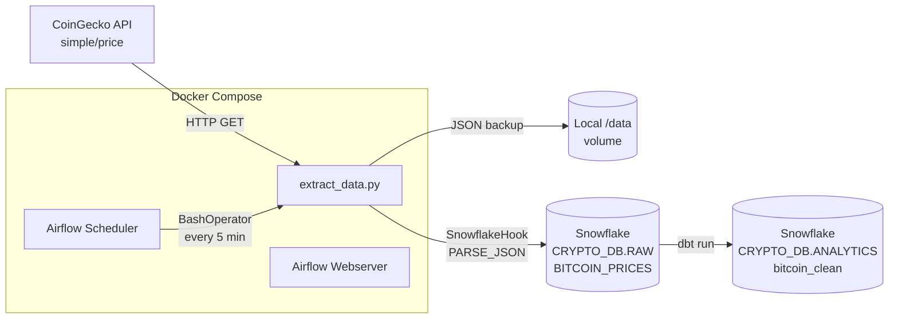

# Crypto ELT Pipeline

A containerized ELT pipeline that ingests Bitcoin price data on a 5-minute schedule, lands it
as semi-structured JSON in Snowflake, and transforms it into an analytics-ready table with dbt.

Built to practice the ingest-to-analytics path end to end: scheduled orchestration, raw
semi-structured storage, and a separated transformation layer.

---

## Architecture



**Flow:** Airflow triggers `extract_data.py` every five minutes. The script calls the CoinGecko
`simple/price` endpoint, stamps the payload with an ingestion timestamp, writes a local JSON
backup, then inserts the raw document into a Snowflake `VARIANT` column via `PARSE_JSON`.
A dbt model reads that raw table and produces a typed, queryable table in the analytics schema.

---

## Stack

| Component | Purpose |
|---|---|
| Apache Airflow 2.6.0 | Orchestration and scheduling |
| Docker Compose | Reproducible local environment |
| CoinGecko API | Source of Bitcoin price data |
| Snowflake | Raw (`VARIANT`) and analytics storage |
| dbt | SQL transformation layer |

---

## Repository layout

```
dags/
  crypto_dag.py        Airflow DAG: 5-minute schedule, 1 retry, 5-minute retry delay
  extract_data.py      API call, local backup, Snowflake insert
dbt/
  dbt_project.yml      dbt project config (crypto_transform)
  models/
    bitcoin_clean.sql  Parses VARIANT into typed columns
Dockerfile             Airflow image + Snowflake/dbt providers
docker-compose.yaml    Local Airflow stack
requirements.txt       apache-airflow-providers-snowflake, dbt-snowflake
```

---

## Setup

**Prerequisites:** Docker and Docker Compose, plus a Snowflake account.

**1. Create the Snowflake objects**

```sql
CREATE DATABASE CRYPTO_DB;
CREATE SCHEMA CRYPTO_DB.RAW;
CREATE SCHEMA CRYPTO_DB.ANALYTICS;

CREATE TABLE CRYPTO_DB.RAW.BITCOIN_PRICES (
    raw_data VARIANT
);
```

**2. Configure credentials**

Copy `.env.example` to `.env` and fill in your Snowflake values. Never commit `.env`.

```
SNOWFLAKE_ACCOUNT=your_account
SNOWFLAKE_USER=your_user
SNOWFLAKE_PASSWORD=your_password
SNOWFLAKE_ROLE=your_role
SNOWFLAKE_WAREHOUSE=COMPUTE_WH
SNOWFLAKE_DATABASE=CRYPTO_DB
SNOWFLAKE_SCHEMA=ANALYTICS
```

**3. Start Airflow**

```bash
docker compose up -d
```

Open http://localhost:8080, add a Snowflake connection with the connection ID
`snowflake_conn`, then enable the `crypto_volatility_pipeline` DAG.

**4. Run the transformation**

```bash
cd dbt
dbt run
```

Result: `CRYPTO_DB.ANALYTICS.bitcoin_clean`, with one row per ingestion.

---

## Design decisions

**Raw JSON in a `VARIANT` column rather than a typed table.**
The API response shape can change — new fields, renamed keys, nested additions. Landing the
whole document in `VARIANT` means ingestion never breaks on a schema change, and parsing
happens downstream in dbt where it can be fixed without touching the pipeline or backfilling.
The cost is that raw data is unqueryable without casting, which is what the dbt layer solves.

**Separate `RAW` and `ANALYTICS` schemas.**
Raw is append-only and never modified; analytics is rebuilt from it. If a parsing rule is
wrong, the fix is re-running dbt rather than re-fetching from the API, which matters because
the source data is time-sensitive and can't be re-requested for a past moment.

**Orchestration with Airflow rather than cron.**
Cron would run the script on schedule but gives no run history, no retry semantics, and no
visibility into whether a run failed. The DAG configures one retry with a five-minute delay,
so a transient API timeout self-heals instead of silently dropping an interval.

**Docker Compose for the whole stack.**
Airflow version, provider packages, and Python dependencies are pinned in the image, so the
environment reproduces from one command rather than depending on local Python state.

**Local JSON backup alongside the Snowflake write.**
If a load fails after the API call, the raw response still exists on disk and the interval can
be recovered without losing the data point.

---

## Known limitations

Honest list of what this project does not yet do:

- **Single asset.** Only Bitcoin is tracked. Extending to more coins requires looping over a
  symbol list rather than a hardcoded URL.
- **Loads are not idempotent.** The insert is a plain `INSERT ... SELECT PARSE_JSON(...)` with
  no natural key or dedup logic, so re-running an interval would create duplicate rows. A
  `MERGE` on `last_updated_at` would fix this.
- **No dbt tests.** There are no `unique`, `not_null`, or freshness tests on the model yet.
- **No backfill path.** `catchup=False` and the API only returns current price, so historical
  gaps cannot be recovered from the source.
- **SQL is string-interpolated** rather than parameterized. It works because the payload is
  machine-generated, but a bound parameter would be the correct pattern.
- **Local backup grows unbounded.** No retention or cleanup policy on the `/data` volume.

---

## Roadmap

- [ ] Parameterize the symbol list to track multiple assets
- [ ] Replace `INSERT` with `MERGE` for idempotent reruns
- [ ] Add dbt tests (`unique`, `not_null`) and a staging/marts split
- [ ] Add volatility and moving-average models over the price history
- [ ] Retention policy on the local backup volume
